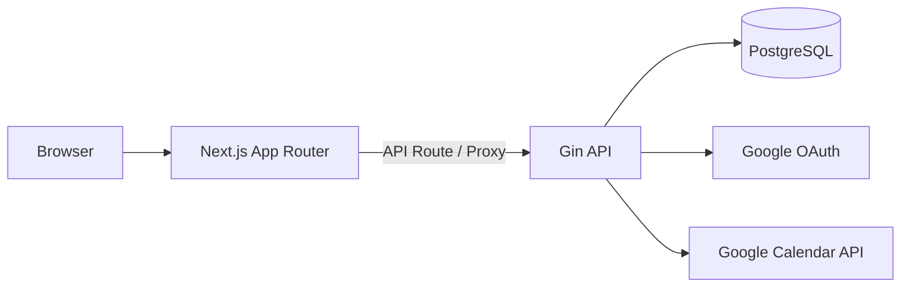

# Adjusta

Googleカレンダーと連携し、日程調整イベントの作成、候補日程の管理、確定までを支援する Web アプリケーションです。

## このアプリの目的

`Adjusta` は、Googleカレンダー上の予定を確認しながら、複数の候補日程を作成・管理し、確定後の反映までを一連の流れで扱えるようにすることを目的としています。

単に候補日程を控えるだけでなく、「どのイベントが対応待ちか」「どの候補が確定したか」「Googleカレンダーと同期できているか」を整理しやすくし、日程調整に伴う確認や転記の手間を減らします。

## 想定ユースケース

- Googleカレンダーを見ながら候補日程を洗い出す
- 調整中イベントを下書きとして保存し、あとから編集する
- 候補日程を確定し、Googleカレンダー側の予定を更新する
- 対応が必要なイベントや直近イベントをダッシュボードで確認する

## 想定ユーザー

- Googleカレンダーを使って日程調整を行う個人ユーザー
- 複数候補を提示することが多い学生・研究・業務ユーザー
- 調整中イベントを一覧で管理したいユーザー

## できること

- Google OAuth によるログイン
- Googleカレンダー一覧と予定の同期
- イベント下書きの作成と複数候補日程の登録
- 候補日程の編集、削除、確定
- 「対応が必要なイベント」「直近のイベント」のダッシュボード表示
- FullCalendar ベースのカレンダー表示とイベント詳細確認

## スクリーンショット

画面キャプチャは準備中です。現時点では `dashboard`、`schedule/draft`、`schedule/draft/[id]`、`schedule/draft/[id]/edit`、`account` を中心に画面が実装されています。

## 技術スタック

- Frontend: Next.js 14, React 18, TypeScript, Tailwind CSS, TanStack Query, Jotai, FullCalendar, Storybook
- Backend: Go 1.23, Gin, ent
- Database: PostgreSQL
- Auth: Google OAuth + session cookie
- External service: Google Calendar API

## リポジトリ構成

- **`frontend`**: Next.js App Router ベースのフロントエンドです。`src/app/api/*` で backend へのプロキシや OAuth コールバックの中継を行います。
- **`backend`**: Go 製 API です。Google OAuth によるログイン、ユーザー情報取得、Googleカレンダー同期、イベント下書きの作成・更新・削除・確定などを提供します。
- **`backend/internal/infrastructure/ent`**: ent による schema と生成コードを管理します。
- **`docs`**: 要件定義、DB 設計、ER図をまとめています。
- **`docker-compose.yml`**: frontend / backend / PostgreSQL のローカル開発構成です。

## アーキテクチャ

本システムは、Next.js フロントエンド、Go API、PostgreSQL、Google OAuth / Google Calendar API を分離した構成です。



- **Frontend**: Next.js App Router による UI 層です。
- **Backend**: Gin を用いた API 層です。
- **PostgreSQL**: ユーザー、セッション、カレンダー、イベント、候補日程を保持します。
- **Google OAuth / Google Calendar API**: 認証とカレンダー同期を担います。

### バックエンドの設計方針

バックエンドは、役割ごとにコードの置き場所を分ける構成にしています。
API の受け口、アプリの処理の流れ、業務ルール、DB や外部サービスとの接続を分けることで、変更しやすく、責務が追いやすい状態を目指しています。

- **`api`**: API リクエストを受け取り、ログイン確認や入力チェックを行って、必要な処理へ受け渡します。
- **`internal/usecase`**: イベント作成・更新・確定など、機能ごとの処理の流れをまとめます。DB 更新や Google Calendar API 呼び出しの順序もここで組み立てます。
- **`internal/domain`**: イベントや候補日程などの業務ルールを置く場所です。データの保存方法や外部サービスの都合にはできるだけ依存しないようにします。
- **`internal/infrastructure`**: PostgreSQL / ent を使った保存処理や、Google Calendar API との通信など、技術的な実装を置く場所です。

## ER図


詳細は [`docs/db-design.md`](docs/db-design.md) を参照してください。

## セットアップ

### 前提条件

- Docker / Docker Compose
- Node.js / npm
- Go 1.23 以上
- Google OAuth / Google Calendar API の利用設定

### ローカル起動手順

1. 環境変数ファイルを用意または調整します。

- ルート `.env`

```dotenv
DB_PORT=
DB_USER=
DB_PASSWORD=
DB_NAME=
DB_TZ=
```

- `backend/.env`

```dotenv
GO_ENV=
DATABASE_URL=
SESSION_SECRET=
DOMAIN=
CORS_ALLOW_ORIGINS=
GOOGLE_CLIENT_ID=
GOOGLE_CLIENT_SECRET=
GOOGLE_REDIRECT_URI=
REDIRECT_URL_AFTER_LOGIN=
```

- `frontend/.env.local`

```dotenv
NEXT_PUBLIC_API_BASE_URL=
INTERNAL_BACKEND_URL=
BACKEND_URL=
```

補足:

- `NEXT_PUBLIC_API_BASE_URL` は frontend 公開 URL を基準に `/api/*` を呼ぶための base URL です。
- `INTERNAL_BACKEND_URL` は Next.js サーバー側から backend を呼ぶ URL です。`docker compose` 利用時は `http://backend:8080` を使えます。
- `BACKEND_URL` は Google ログイン開始時のリダイレクト先に使う backend の公開 URL です。

2. 初回起動時、または migration が追加されたときにDB migrationを実行します。

```bash
docker compose --profile tools run --rm migrate
```

3. Docker Compose で一式を起動します。

```bash
docker compose up --build
```

デフォルトでは以下で動作します。

- Frontend: `http://localhost:3000`
- Backend: `http://localhost:8080`
- PostgreSQL: `.env` の `DB_PORT` で公開

4. 必要に応じて、DB だけ Docker で起動し、frontend / backend を個別に立ち上げることもできます。

```bash
docker compose up db
```

```bash
cd backend
go run .
```

```bash
cd frontend
npm install
npm run dev
```

## 開発ガイド

仕様判断や設計判断を行うときは、以下を優先して参照してください。

- [`AGENTS.md`](AGENTS.md)
- [`docs/requirements.md`](docs/requirements.md)
- [`docs/db-design.md`](docs/db-design.md)
- [`docs/rearchitecture-memo.md`](docs/rearchitecture-memo.md)
- [`backend/AGENTS.md`](backend/AGENTS.md)
- [`frontend/AGENTS.md`](frontend/AGENTS.md)

## 主要コマンド

- フルスタック起動: `docker compose up --build`
- フルスタック停止: `docker compose down`
- DB migration適用: `docker compose --profile tools run --rm migrate`
- DB migration生成: `cd backend && atlas migrate diff <name> --env local`
- Frontend 開発サーバー: `cd frontend && npm run dev`
- Frontend Lint: `cd frontend && npm run lint`
- Frontend E2E: `cd frontend && npm run test:e2e`
- Frontend Storybook: `cd frontend && npm run storybook`
- Backend テスト: `cd backend && go test ./...`

## テスト

- Backend には `go test ./...` で実行できるテストがあります。
- Frontend には Playwright によるE2Eテストがあります。初回実行前に `cd frontend && npx playwright install chromium` でブラウザを導入してください。

## 今後の拡張候補

- 候補日程のメール文面生成とテンプレート化
- 同期失敗時の再試行導線と運用補助
- 確定後の再調整フロー強化

## 開発基盤の改善候補

- セッション主体の認証基盤の整理
- CI/CD パイプラインの整備
- frontend / backend の自動テスト拡充
- Lint やテストの自動実行環境の整備
