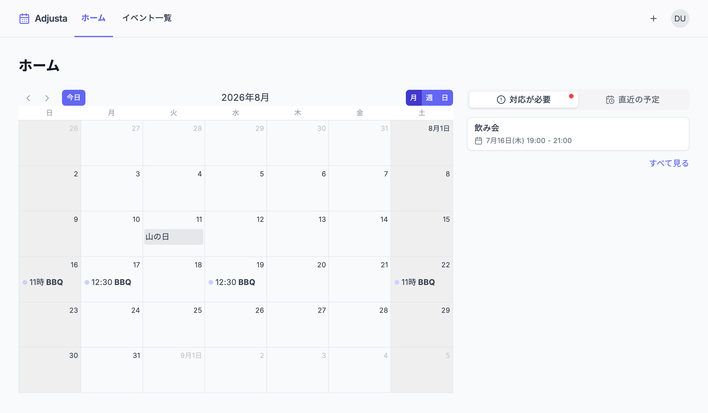
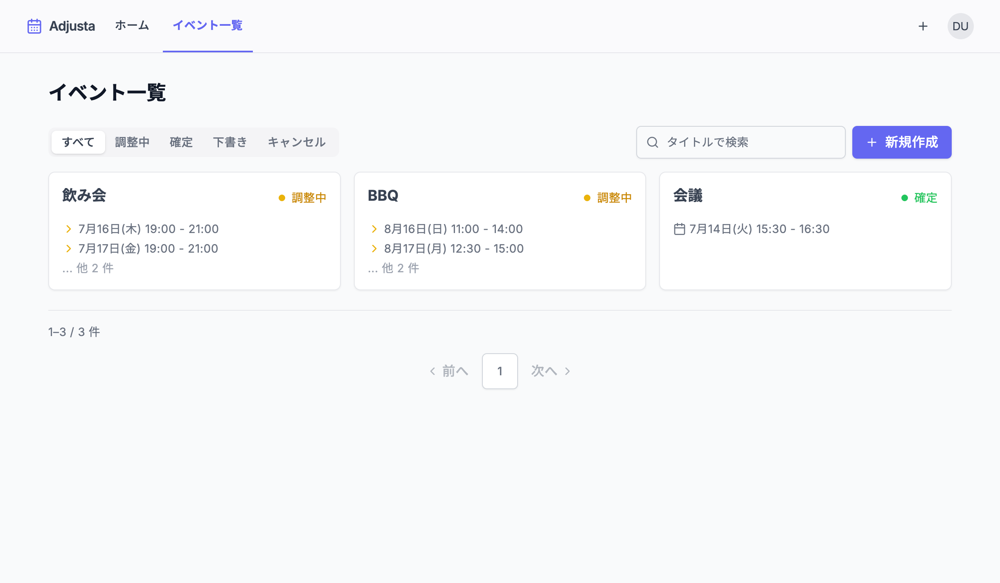
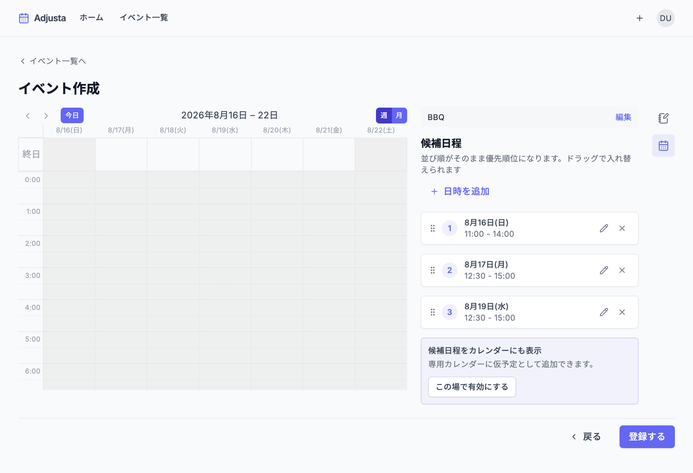
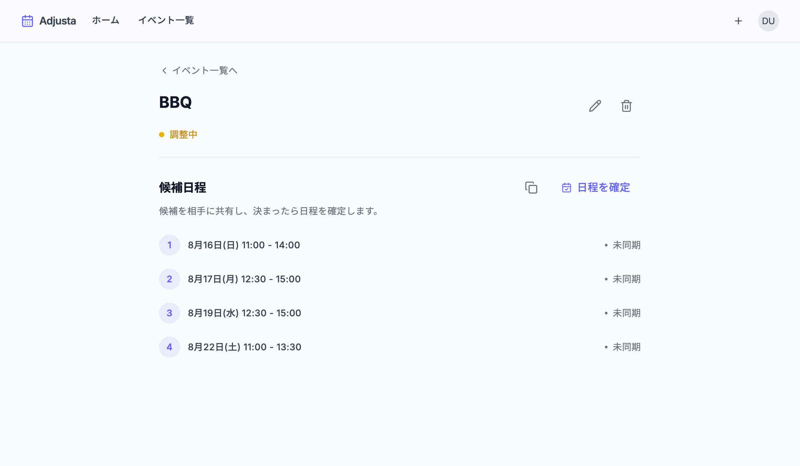
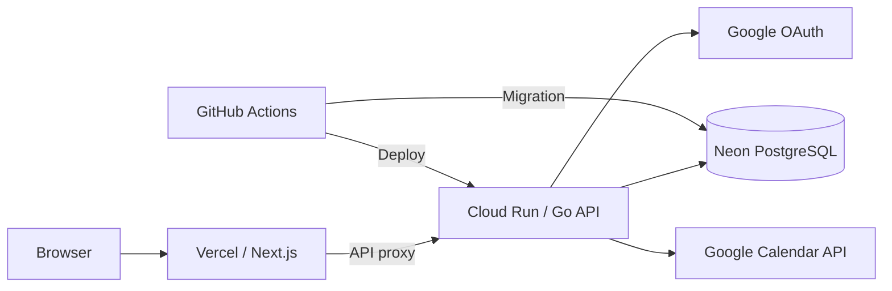

# Adjusta

Googleカレンダーを見ながら複数の候補日程を管理し、日程の確定までを一つの流れで進められるWebアプリケーションです。

**[Adjustaを開く](https://adjusta.vercel.app)**

## 何をするアプリか

Adjustaは、日程調整中のイベントと候補日程をまとめて管理するためのアプリです。

Googleカレンダーの予定を確認しながら複数の候補を作成し、相手から回答を受けた後は、その中から日時を確定できます。必要に応じて候補予定を専用カレンダーへ表示し、確定した予定はメインカレンダーへ反映します。

## 解決したい課題

日程調整では、次のような作業が別々になりがちです。

- カレンダーを見ながら空いている時間を探す
- 複数の候補日程をメモして相手へ伝える
- 返信待ちのイベントを管理する
- 決まった予定をカレンダーへ登録する

Adjustaでは、候補の作成から確定までをイベント単位で管理し、転記の手間や予定の管理漏れを減らします。

## 主な利用フロー

1. Googleアカウントでログインする
2. カレンダーを確認しながらイベントと候補日程を作成する
3. 調整中のイベントを下書きとして保存・編集する
4. 相手からの回答に合わせて日時を確定する
5. 確定した予定をGoogleカレンダーへ登録・更新する

## 主な機能

| 機能 | できること |
| --- | --- |
| Googleログイン | Googleアカウントを使ってログインする |
| カレンダー表示 | Googleカレンダーの予定とAdjustaのイベントを確認する |
| イベント管理 | 下書きの作成、一覧・詳細表示、編集、削除を行う |
| 候補日程管理 | 複数候補の追加、日時変更、並び替え、削除を行う |
| 日程確定 | 候補の中から日時を確定し、Googleカレンダーへ反映する |
| 候補予定の同期 | 必要な場合だけ、候補予定をAdjusta専用カレンダーへ表示する |
| ダッシュボード | 対応が必要なイベントと直近の予定を確認する |
| カレンダー設定 | 確定予定の登録先と候補予定の同期を個別に設定する |

候補予定の同期は初期状態ではOFFです。ONにしたときだけAdjusta専用カレンダーを作成します。

## スクリーンショット

### ダッシュボード

Googleカレンダーの予定と、対応が必要な調整イベントを一つの画面で確認できます。



### イベント一覧

調整状態ごとにイベントを絞り込み、候補日程や確定日時を確認できます。



### イベント作成

カレンダーを見ながら候補日程を追加し、ドラッグ操作で優先順位を変更できます。



### イベント詳細

候補日程を優先順に確認・コピーし、調整後の日時を確定できます。



---

ここからは、実装と開発環境について説明します。

## 開発で工夫した点

### 認証情報をブラウザへ公開しない構成

ブラウザからの通信はNext.jsを経由してGo APIへ転送します。Googleログインの開始と完了も同じ経路へ統一し、Backendの接続先やGoogle OAuthの秘密情報をブラウザへ公開しない構成にしています。

セッションCookieには`HttpOnly`、`Secure`、`SameSite=Lax`を設定しています。APIの利用中にセッションが切れた場合は、共通のエラー処理からログイン画面へ戻します。

### Googleカレンダーへの重複登録を防ぐ同期処理

候補予定ごとに同期状況、Googleカレンダー上の予定ID、最終同期日時、エラー内容を記録しています。一度同期した内容は、イベントが編集されるまで再登録しないことで、同じ予定が重複して作成されることを防ぎます。

同期に失敗した場合もAdjusta側のイベントは保持し、後から再試行できるようにしています。失敗からの復旧と、同じ操作を繰り返した場合の動作はBackendテストで確認しています。

### 変更の影響範囲を追いやすいBackend設計

機能追加や外部サービスの変更へ対応しやすいよう、業務ルールとDB・Google Calendar APIとの接続処理を分けています。

Backendには、DDDの考え方を取り入れたレイヤードアーキテクチャを採用しています。API、usecase、domain、infrastructureの責務を分離し、業務ルールがHTTP、DB、Google Calendar APIの実装詳細へ依存しない構成を目指しています。

- `backend/api`: HTTPハンドラー、ミドルウェア、入力検証、レスポンス生成
- `backend/internal/usecase`: トランザクションと機能ごとの処理フロー
- `backend/internal/domain`: イベントや候補日程の業務ルール
- `backend/internal/infrastructure`: ent/PostgreSQL、Google OAuth、Google Calendar APIとの接続

設計変更の経緯は[再設計メモ](docs/rearchitecture-memo.md)にまとめています。

### DB変更とデプロイを安全に進める仕組み

DBの変更は履歴としてGitで管理し、アプリケーションの起動処理とは分離しています。本番デプロイでは、新しいCloud Run環境へ切り替える前にGitHub ActionsからDB変更を適用します。

Ent SchemaとAtlasのversioned migrationを使用し、Cloud Runの新旧リビジョンが同時に動く可能性を考慮しています。GitHub ActionsからGCPへの認証にはOIDCとWorkload Identity Federationを使い、長期間有効なサービスアカウントキーを保存しません。

詳しい構成は[デプロイ方針](docs/deployment.md)と[デプロイ手順](docs/deployment-runbook.md)を参照してください。

## アーキテクチャ



### データモデル


テーブルの制約、削除方針、同期状態の詳細は[DB設計](docs/db-design.md)を参照してください。

## 技術スタック

| 分類 | 技術 |
| --- | --- |
| Frontend | Next.js 16、React 19、TypeScript、Tailwind CSS、TanStack Query、Jotai、FullCalendar、shadcn/ui・Radix UI（段階移行中） |
| Backend | Go 1.23、Gin、ent |
| Database | PostgreSQL、Atlas |
| Authentication | Google OAuth 2.0、セッションCookie |
| External API | Google Calendar API |
| Testing | Playwright、Go testing |
| Infrastructure | Vercel、Cloud Run、Neon、Artifact Registry、Secret Manager |
| CI/CD | GitHub Actions、Workload Identity Federation |

## テスト・CI/CD


### Frontend

Playwrightで、公開画面、認証、イベントの作成・編集・詳細・確定・削除、カレンダー設定などの主要な操作を確認しています。自動テストでは実際のGoogleアカウントやGoogleカレンダーを変更せず、テスト用Backendを使用します。

```bash
cd frontend
npm run test:e2e
```

Frontend関連のPRではE2Eを実行し、テスト結果をGitHub Actionsの成果物として保存します。

### Backend

HTTPハンドラー、ミドルウェア、業務ルール、処理フロー、Googleカレンダーとの通信を対象にテストしています。認証・権限、入力検証、同期失敗、再試行、重複登録の防止などを確認します。

```bash
cd backend
go test ./...
```

Backend関連のPRではGoテストに加え、DB変更履歴の検証とEnt Schemaとの差分確認を行います。

詳細は[Frontendテスト方針](docs/testing/frontend.md)と[Backendテスト方針](docs/testing/backend.md)を参照してください。

## ローカルセットアップ

### 前提条件

- Docker / Docker Compose
- Google OAuth client
- Google Calendar APIを有効にしたGCP project

Node.js 20以上とGo 1.23以上があれば、FrontendとBackendを個別に起動することもできます。

### 1. 環境変数を設定する

ルート`.env`:

```dotenv
DB_PORT=
DB_USER=
DB_PASSWORD=
DB_NAME=
DB_TZ=
```

`backend/.env`:

```dotenv
GO_ENV=development
DATABASE_URL=
SESSION_SECRET=
DOMAIN=
CORS_ALLOW_ORIGINS=http://localhost:3000
GOOGLE_CLIENT_ID=
GOOGLE_CLIENT_SECRET=
GOOGLE_REDIRECT_URI=http://localhost:3000/api/auth/google/callback
REDIRECT_URL_AFTER_LOGIN=http://localhost:3000
```

`frontend/.env.local`:

```dotenv
NEXT_PUBLIC_API_BASE_URL=
INTERNAL_BACKEND_URL=http://backend:8080
```

`NEXT_PUBLIC_API_BASE_URL`は空のままにします。Docker Composeを使わずFrontendだけをホスト上で動かす場合は、`INTERNAL_BACKEND_URL`を`http://localhost:8080`へ変更します。

Google OAuth clientの承認済みリダイレクトURIにも`http://localhost:3000/api/auth/google/callback`を登録してください。秘密値をGitへコミットしないでください。

### 2. DB変更を適用する

```bash
docker compose --profile tools run --rm migrate
```

### 3. アプリケーションを起動する

```bash
docker compose up --build
```

- Frontend: `http://localhost:3000`
- Backend: `http://localhost:8080`
- PostgreSQL: ルート`.env`の`DB_PORT`

## リポジトリ構成

```text
.
├── frontend/                 # Next.js App Router
│   ├── e2e/                  # Playwright E2E
│   └── src/
├── backend/                  # Go API
│   ├── api/                  # HTTPの入口
│   ├── internal/             # usecase/domain/infrastructure
│   └── migrations/           # DB変更履歴
├── docs/                     # 要件・設計・テスト・デプロイ資料
├── .github/workflows/        # CI/CD
└── docker-compose.yml        # ローカル開発環境
```

## 主要コマンド

| 操作 | コマンド |
| --- | --- |
| アプリケーション起動 | `docker compose up --build` |
| アプリケーション停止 | `docker compose down` |
| DB変更の適用 | `docker compose --profile tools run --rm migrate` |
| DB変更ファイルの生成 | `cd backend && atlas migrate diff <name> --env local` |
| Frontendの入力検査 | `cd frontend && npm run lint` |
| Frontendの本番ビルド | `cd frontend && npm run build` |
| Frontend E2E | `cd frontend && npm run test:e2e` |
| Storybook | `cd frontend && npm run storybook` |
| Backendテスト | `cd backend && go test ./...` |

## ドキュメント

| ドキュメント | 内容 |
| --- | --- |
| [要件定義](docs/requirements.md) | 機能・画面・API要件と優先度 |
| [DB設計](docs/db-design.md) | テーブル、制約、削除方針、DB変更方針 |
| [再設計メモ](docs/rearchitecture-memo.md) | Backendのレイヤー配置と判断理由 |
| [画面設計](docs/screen-design.md) | 画面構成、表示内容、遷移 |
| [デザイン仕様](frontend/DESIGN.md) | 色、文字、余白、影の設計 |
| [デプロイ方針](docs/deployment.md) | Vercel、Cloud Run、Neonの構成判断 |
| [デプロイ手順](docs/deployment-runbook.md) | 本番環境の構築、デプロイ、確認、復旧 |

## 今後の改善

- 候補日程を共有する文面生成・テンプレート機能の強化
- 同期失敗時の再試行画面と運用支援
- Preview環境向けのOAuth・Backend構成
- 実際のBackendとテストDBを接続した統合テスト
