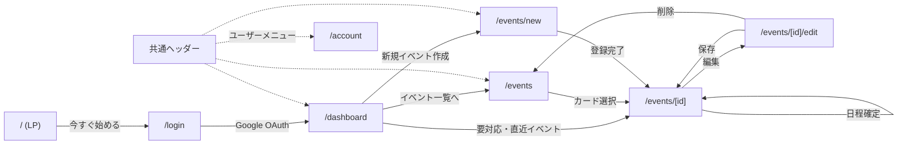

# Adjusta 画面設計書

## 1. 概要

### 1.1 目的

本設計書は、Adjusta で用意するページの一覧と、各ページで表示する内容・導線・状態表示を定義し、フロントエンド実装の基準とすることを目的とする。

Adjusta は、Google Calendar と連携し、日程調整における候補日程の作成、管理、確定、候補日程共有を支援する Web アプリケーションである。

画面に関する要求の一次情報は `requirements.md` 9章(画面要件)であり、本書はこれをページ単位に具体化し、表示データ(DB エンティティ・API)との対応、認証・エラーの共通仕様、画面遷移を統合して記述する。

### 1.2 対象範囲

本書の対象は初期リリース範囲(`requirements.md` 17章の Must / Should)の画面とする。

Could に分類される機能(メール文面作成画面、検索・絞り込み、テンプレート保存)は「8. 将来拡張」で言及するに留め、画面定義の対象外とする。

### 1.3 前提

| 項目 | 内容 |
| --- | --- |
| フレームワーク | Next.js App Router |
| ルーティング構成 | route group `(marketing)` / `(auth)` / `(app)` に分割(`rearchitecture-memo.md` 4.1.8 の ADR に従う) |
| 認証 | Google OAuth + httpOnly session cookie |
| 状態管理方針 | server data / form(draft) state / UI state の分離(`rearchitecture-memo.md` 5.1) |
| 関連ドキュメント | `requirements.md`(機能・画面要件)、`db-design.md`(エンティティ・enum)、`rearchitecture-memo.md`(認証境界 ADR・フロントエンド方針)、`ui-guidelines.md`(コンポーネント利用規約)、`frontend/DESIGN.md`(デザイン仕様の正) |

本書の URL 構成はあるべき姿として再設計したものであり、現実装のパスと一部異なる。差分は「9. 現実装との差分(移行課題)」に整理する。

---

## 2. 画面一覧

| # | 画面名 | URL | route group | 認証 | 対応要件 |
| --- | --- | --- | --- | --- | --- |
| 1 | LP(サービス紹介) | `/` | (marketing) | 不要 | 8.9 |
| 2 | ログイン | `/login` | (auth) | 不要 | 8.1 |
| 3 | ダッシュボード | `/dashboard` | (app) | 必要 | 8.2 |
| 4 | イベント一覧 | `/events` | (app) | 必要 | 8.4 |
| 5 | イベント作成 | `/events/new` | (app) | 必要 | 8.3 |
| 6 | イベント詳細 | `/events/[id]` | (app) | 必要 | 8.5 |
| 7 | イベント編集 | `/events/[id]/edit` | (app) | 必要 | 8.6 |
| 8 | アカウント・カレンダー設定 | `/account` | (app) | 必要 | 8.8 |

- メール文面作成画面(要件 8.7)は Could のため本一覧に含めない。初期リリースにおける候補日程共有の主導線は、イベント詳細画面の「候補日程一覧のコピー」とする(要件 5.6、`rearchitecture-memo.md` 4.6)。
- 現実装に存在するカレンダー単体ページ(`/schedule`)は廃止し、カレンダー表示はダッシュボードに統合する方針とする(移行課題 9.2)。

---

## 3. 画面遷移

基本フロー(要件 4.1)との対応: ログイン → ダッシュボードで予定確認 → イベント作成(候補日程を Google Calendar に仮予定登録)→ 詳細画面で候補一覧をコピーして相手に提示 → 返信をもとに詳細画面で確定 → 本予定登録・候補整理。

### リダイレクト規則

- 未認証で `(app)` 配下へアクセス → `/login` へリダイレクト
- 認証済み(session cookie あり)で `/` または `/login` へアクセス → `/dashboard` へリダイレクト

いずれも middleware では session cookie の存在チェックのみで判定する(楽観的ルーティング。詳細は 4.1)。

---

## 4. 共通仕様

### 4.1 認証境界とエラーハンドリング

`rearchitecture-memo.md` 4.1.8 の ADR に従う。

- `(app)` 以外の route group は認証状態を参照しない
- middleware は session cookie の存在のみで楽観的にルーティングし、真の認証判定はサーバー側 API が行う
- API が **401**(ログイン失効)を返した場合: `/api/auth/session-expired` に遷移して cookie を失効させ、フルリロードで `/login` へ誘導する
- API が **409**(`google_reauthorization_required`)を返した場合: ログイン失効とは区別し、再認可導線のモーダル(`AuthErrorModal`)を表示する
- フォームの必須未入力、開始日時 ≧ 終了日時、候補日程が空、はいずれも画面内エラー表示とし、次に取るべき行動を提示する(要件 6.5、14章)

### 4.2 共通レイアウト

| 領域 | 内容 |
| --- | --- |
| (marketing) | `MarketingHeader`(ロゴ + ログインボタン)/ `MarketingFooter` |
| (auth) | 中央寄せの単純なレイアウト(ヘッダーなし) |
| (app) ヘッダー | sticky。ロゴ(`/dashboard` へ)/ ナビ「ホーム」「イベント一覧」/ イベント作成ボタン / ユーザーメニュー(Suspense + async server component、名前・アバター表示、アカウント設定・ログアウト) |
| (app) 共通 | トースト通知、`AuthErrorModal`(再認可モーダル)、モバイルはハンバーガーメニュー |
| テーマ | light 固定。dark / system 対応は将来拡張(`frontend/DESIGN.md` に従う) |

### 4.3 状態表示の規則

画面上のステータスバッジは `db-design.md` 6章の enum に対応させる。

| enum | 値と表示例 |
| --- | --- |
| EventStatus | draft(下書き)/ active(調整中)/ confirmed(確定済み)/ cancelled(中止) |
| ProposedDateStatus | active(候補)/ confirmed(確定)/ not_selected(非選択)/ cancelled(取り下げ) |
| SyncStatus | not_synced(未同期)/ pending_sync(同期待ち)/ synced(同期済み)/ sync_failed(同期失敗) |

候補日程の優先順位(`proposed_dates.priority`)は、内部的には数値が大きいほど高優先だが、**画面上は最優先を 1 とした順位(1, 2, 3, …)で表示**する(要件 5.4.2、`db-design.md` 5.7 補足)。

---

## 5. 画面定義

各画面は「目的 / 表示データ / 主要 UI 要素 / 導線 / エラー・エッジケース」の形式で定義する。表示データの API は `backend/internal/app/router.go` のエンドポイントに対応する。

### 5.1 LP(サービス紹介) `/`

#### 目的

未ログインユーザーにサービスの価値を伝え、ログインへ誘導する。

#### 表示データ

なし(静的コンテンツのみ。認証状態を参照しない)。

#### 主要 UI 要素

- キャッチコピー(例: 「日程調整をもっとシンプルに」)とサービス説明
- 主要機能の紹介(カレンダー連携・候補日程管理・確定)
- 「今すぐ始める」ボタン(`/login` へ)

#### 導線

- → `/login`

### 5.2 ログイン `/login`

対応要件: 8.1

#### 目的

ユーザーが Google アカウントでログインする。

#### 表示データ

なし。

#### 主要 UI 要素

- サービス説明(簡潔なもの)
- Google ログインボタン(`/api/auth/google/login` → バックエンド `GET /auth/google/login` へ)
- エラー表示(OAuth 失敗・キャンセル時)

#### 導線

- → OAuth 成功後 `/dashboard`
- 認証済みユーザーがアクセスした場合は `/dashboard` へリダイレクト

#### エラー・エッジケース

- OAuth 同意キャンセル・失敗時は本画面に戻し、エラーメッセージと再試行ボタンを表示する

### 5.3 ダッシュボード `/dashboard`

対応要件: 8.2

#### 目的

ログイン後のホーム。自身の予定と作成済みイベントの状況を把握し、次の行動(作成・確認・確定)へ移る。

#### 表示データ

| データ | エンティティ | API |
| --- | --- | --- |
| 要対応の下書きイベント | events(status = draft / active) | `GET /api/event/draft/needs-action` |
| 直近の確定イベント | events(status = confirmed)+ 確定日程 | `GET /api/event/confirmed/upcoming` |
| カレンダー表示(自分の予定) | Google Calendar 予定 + user_calendars(is_visible = true のカレンダー) | `GET /api/calendar/list` |

#### 主要 UI 要素

- **要対応イベント**セクション: 調整中・下書きのイベントを提示し、詳細画面へ誘導する
- **直近のイベント**セクション: 確定済みイベントを日時順に表示する
- **カレンダー表示**: 月表示を基本とし、自分の予定と Adjusta の候補・確定予定を確認できる
- 新規イベント作成ボタン(→ `/events/new`)
- イベント一覧への導線(→ `/events`)

#### 導線

- → `/events/new`、`/events`、`/events/[id]`(各セクションのイベントから)

#### エラー・エッジケース

- イベント未作成時は空状態表示とし、作成ボタンへ誘導する
- カレンダー取得失敗時はカレンダー領域のみエラー表示し、他セクションは表示を継続する

### 5.4 イベント一覧 `/events`

対応要件: 8.4

#### 目的

作成済みイベントを一覧で確認し、詳細画面へ移動する。一覧では情報量を絞り、候補日程の確認は詳細画面で行う(要件 6.5)。

#### 表示データ

| データ | エンティティ | API |
| --- | --- | --- |
| イベント一覧 | events(+ proposed_dates の要約) | `GET /api/event/draft/search`(status 絞り込み・page/per_page 対応) |

実装メモ(2026-07-10): 当初想定の `GET /api/calendar/event/draft/list` は Google カレンダー同期ミドルウェア配下で毎回 Google API を呼ぶ(遅延・再認可 409 のリスク)ため、DB 参照のみで status 絞り込み・ページネーションも備える search API に一本化した。list API 自体はバックエンドに存置。

#### 主要 UI 要素

- イベントカード(またはリスト行): タイトル / EventStatus バッジ / 候補日程の件数・直近候補日時 / 確定済みの場合は確定日時
- 詳細画面へのリンク(カード全体をクリック可能とする)
- 新規イベント作成ボタン
- ステータス絞り込みタブ(すべて / 調整中 / 確定 / 下書き / キャンセル)。選択タブとページ番号は URL クエリ(`?status=`, `?page=`)に保持する **(2026-07-10 実装)**
- ページネーション(バックエンド既定 per_page=20 に追随)**(2026-07-10 実装)**

キーワード検索(要件 8.4 に記載)は Could のため初期対象外とする(8章・移行課題 9.4 参照)。ステータス絞り込みタブのみ `ui-review.md` P2 #10 として先行実装した。

#### 導線

- → `/events/[id]`、`/events/new`

#### エラー・エッジケース

- イベント 0 件時は空状態表示 + 作成導線
- ステータス別の視認性を確保する(draft / active / confirmed / cancelled が混在するため)

### 5.5 イベント作成 `/events/new`

対応要件: 8.3

#### 目的

日程調整イベントと候補日程を作成し、候補予定を Google Calendar(Adjusta 専用カレンダー)に仮予定として登録する。

#### 表示データ

| データ | エンティティ | API |
| --- | --- | --- |
| 自分の予定(空き確認用カレンダー) | Google Calendar 予定 | `GET /api/calendar/list` |
| 登録先カレンダー選択肢 | calendars + user_calendars(role = primary 等) | -(取得・保存 API は未整備。移行課題 9.6) |
| 作成処理 | events + proposed_dates | `POST /api/calendar/event/draft` |

#### 主要 UI 要素

- タイトル入力(必須)/ 説明入力 / 場所入力
- カレンダー選択(確定予定の登録先 = primary_calendar_id)
- 日時選択コンポーネント: カレンダー上の自分の予定を見ながら候補日時(開始・終了)を直感的に選択できる(要件 6.5)
- 候補日程一覧: 追加済み候補の表示・削除。複数登録可
- 登録ボタン

フォーム入力は draft state として管理し、server data と分離する(`rearchitecture-memo.md` 5.1)。

#### 導線

- 登録完了 → `/events/[id]`(作成したイベントの詳細)

#### エラー・エッジケース

- タイトル未入力 / 開始日時 ≧ 終了日時 / 候補日程が空 の場合はエラーを表示し登録を防止する(要件 14章)
- Google Calendar への仮予定登録に失敗した場合も DB 登録は成立させ、SyncStatus(sync_failed)として詳細画面で提示する

### 5.6 イベント詳細 `/events/[id]`

対応要件: 8.5

#### 目的

イベントの内容と候補日程を確認し、候補日程の共有(コピー)と日程の確定を行う。

#### 表示データ

| データ | エンティティ | API |
| --- | --- | --- |
| イベント基本情報・候補日程 | events + proposed_dates | `GET /api/calendar/event/draft/:id` |
| 日程確定 | events.confirmed_date_id ほか | `PATCH /api/calendar/event/confirm/:id` |

Google Calendar との同期は本画面アクセス時に行う(要件 12.3)。同期に失敗した場合も画面自体は可能な範囲で表示し、同期状態を明示する。

#### 主要 UI 要素

- イベント基本情報: タイトル / 説明 / 場所 / EventStatus バッジ / 登録先カレンダー名
- 候補日程一覧: 優先順位(表示上 1, 2, 3, …)/ 開始・終了日時 / ProposedDateStatus / 候補ごとの SyncStatus
- Google Calendar 同期状態の表示: イベント全体の sync_status、失敗時は last_sync_error に基づくメッセージと再試行導線
- **候補日程一覧のコピー**ボタン: 候補をテキスト形式(日時順または優先順位順)でクリップボードへコピーする。初期リリースにおける共有の主導線(要件 5.6)
- **確定ボタン**: 候補日程を 1 つ選択して確定する。確定した候補は confirmed、それ以外は not_selected となり、確定予定がメインカレンダーに本予定として登録される(要件 5.5)
- 編集ボタン(→ `/events/[id]/edit`)
- (将来拡張)メール文面作成ボタン — 8章参照

#### 導線

- → `/events/[id]/edit`
- 確定後は本画面に留まり、確定済み表示(EventStatus = confirmed)へ更新する

#### エラー・エッジケース

- 存在しない ID / 他ユーザーのイベント → 404 相当の表示とイベント一覧への導線
- 確定操作の確認: 確定は Google Calendar への本予定登録を伴うため、確認ダイアログを挟む
- 確定済みイベントの再調整(confirmed → active)は編集画面から行う

### 5.7 イベント編集 `/events/[id]/edit`

対応要件: 8.6

#### 目的

作成済みイベントの基本情報と候補日程を編集する。

#### 表示データ

| データ | エンティティ | API |
| --- | --- | --- |
| 編集対象イベント | events + proposed_dates | `GET /api/calendar/event/draft/:id` |
| 更新処理 | 同上 | `PUT /api/calendar/event/draft/:id` |
| 削除処理 | 同上(Soft Delete) | `DELETE /api/calendar/event/draft/:id` |

#### 主要 UI 要素

- 基本情報入力欄(タイトル / 説明 / 場所 / カレンダー選択)
- 候補日程編集 UI: 候補の追加・削除・日時変更
- **ドラッグ&ドロップによる優先順位変更**(既存の `DraggableList` コンポーネントを利用): 並び替えはフロント中心で行い、保存時に priority を反映する(要件 5.4.2)
- 保存ボタン
- 削除ボタン(確認ダイアログ必須 — 要件 5.3.5。削除時は同期済みの仮予定も Google Calendar から削除する)

#### 導線

- 保存 → `/events/[id]`
- 削除 → `/events`

#### エラー・エッジケース

- 作成画面と同一のバリデーション(必須・日時前後・候補空)
- 編集中の未保存変更がある状態での離脱には確認を挟む
- 候補削除時、Google Calendar 側の仮予定削除に失敗した場合は sync_failed として詳細画面で提示する

### 5.8 アカウント・カレンダー設定 `/account`

#### 目的

ログイン中のアカウント情報と Google 連携状態の確認、カレンダーごとの利用設定(表示対象・確定予定の登録先・候補同期)を行う。

#### 実装フェーズ

- **Phase 1(表示系)**: プロフィール / Google 連携 / ログアウト(既存 API のみで実装可。`ui-review.md` バックログ #16 に対応)— **実装済み(2026-07-09)**
- **Phase 2(カレンダー設定)**: カレンダー設定セクション(新規 API とセットで実装。移行課題 9.5)— **実装済み(2026-07-09)**

#### 表示データ

| データ | エンティティ | API |
| --- | --- | --- |
| ユーザー情報 | users(name / email / avatar_url) | `GET /api/users/me` |
| 連携アカウント | accounts(expires_at / scope) | `GET /api/account/list` |
| カレンダー設定 | calendars + user_calendars | `GET /api/user-calendars`(**新規**) |
| 設定変更 | user_calendars | `PATCH /api/user-calendars/:id`(**新規**) |

#### 画面構成と主要 UI 要素

**1. プロフィール**

- アバター(画像取得失敗時はイニシャル表示にフォールバック)/ 名前 / メールアドレス
- Google アカウント由来のため編集不可であることを補足表示する(アプリ側の編集 UI は置かない)

**2. Google 連携**

- 連携状態の表示: 正常 / 再認可が必要(accounts のトークン失効・スコープ不足から判定)
- 付与スコープの説明(Google Calendar との連携に使用している旨)
- **再認可ボタン**: 409(`google_reauthorization_required`)時の `AuthErrorModal` と同一の再認可フローに接続する(導線を一元化し、この画面独自のフローを作らない)
- **ログアウトボタン**(確認ダイアログ付き)→ `/` へ

**3. カレンダー設定**(この画面のコア)

calendars × user_calendars の一覧。各行に以下を表示する:

- カレンダー名(summary)/ タイムゾーン
- **role バッジ**: メイン(確定予定の登録先)/ Adjusta 候補用 / 参照
- **is_visible トグル**: アプリの予定確認(ダッシュボード・作成画面のカレンダー)に表示するか
- **候補同期トグル**(sync_proposed_dates): **role = adjusta_candidate の行にのみ表示**(db-design 5.5 のとおり他の行では意味を持たない)

操作仕様:

- **確定予定の登録先(primary)の付け替え**: 一覧から 1 つだけ選択できる(UNIQUE(user_id) WHERE role='primary' 準拠)。変更はサーバ側で旧 primary を reference に降格し、「今後作成するイベントに適用されます(既存イベントの登録先は変わりません)」と説明を出す
- **Adjusta 候補用カレンダーは自動管理**: Adjusta が自動作成するもので、名称変更・削除・付け替えはできない旨を説明表示する
- **候補同期トグルの挙動説明を UI に明記**(db-design 5.5 補足準拠): ON→OFF「専用カレンダーは削除されません(同期を停止します)」/ OFF→ON「専用カレンダーが存在しない場合は再作成されます」
- トグル・付け替えの変更は楽観更新とし、失敗時はロールバック + エラートースト

**4. 将来拡張(UI は置かない)**

- 退会・データ削除(要件定義書に記載がないため、要件側の判断待ち。移行課題 9.7 参照)

#### 導線

- ヘッダーのユーザーメニューから遷移
- ログアウト → `/`

#### エラー・エッジケース

- 再認可が必要な状態では、カレンダー設定セクションを操作不可(無効化)にし、再認可導線を優先して表示する
- カレンダーが 0 件(初回同期前・取得失敗)の場合は空状態表示(取得失敗時は再試行導線)
- 設定変更 API のエラーは該当行の状態を元に戻し、トーストで通知する

#### 必要な API(新規・Phase 2)

| API | 内容 |
| --- | --- |
| `GET /api/user-calendars` | ユーザーのカレンダー一覧(calendar 情報 + role + is_visible + sync_proposed_dates) |
| `PATCH /api/user-calendars/:id` | is_visible / sync_proposed_dates の変更、primary の付け替え(旧 primary の降格を含む)。sync_proposed_dates OFF→ON 時は Adjusta 専用カレンダーの存在確認・再作成を行う |

---

## 6. 画面とデータ更新の対応(参考)

| 操作 | 画面 | API | 主な状態変化 |
| --- | --- | --- | --- |
| イベント作成 | `/events/new` | `POST /api/calendar/event/draft` | events 作成(draft/active)、proposed_dates 作成、Adjusta 専用カレンダーへ仮予定登録 |
| イベント更新 | `/events/[id]/edit` | `PUT /api/calendar/event/draft/:id` | 基本情報・候補・priority 更新、仮予定同期 |
| イベント削除 | `/events/[id]/edit` | `DELETE /api/calendar/event/draft/:id` | Soft Delete、仮予定削除 |
| 日程確定 | `/events/[id]` | `PATCH /api/calendar/event/confirm/:id` | EventStatus → confirmed、確定候補 → confirmed / 他候補 → not_selected、メインカレンダーへ本予定登録 |

---

## 7. レスポンシブ・アクセシビリティ方針

- モバイル幅では (app) ヘッダーのナビをハンバーガーメニューに収納する
- 一覧はモバイルでカード縦積み、デスクトップでグリッドまたはテーブル表示とする
- ドラッグ&ドロップによる並び替えには、モバイル・キーボード操作向けの代替手段(上下移動ボタン等)を用意することを推奨する

---

## 8. 将来拡張(Could)

初期リリースでは対象外とし、画面定義を行わない。導入時に本書へ追記する。

| 機能 | 想定画面 | 備考 |
| --- | --- | --- |
| メール文面作成(要件 8.7) | `/events/[id]/mail` 等 | 件名・本文エディタ、候補日程の自動挿入、テンプレート選択。導入までは詳細画面の候補コピーが共有の主導線 |
| 検索・絞り込み(要件 8.4 の一部、要件 9.3) | `/events` 内 | ステータス・キーワードによる絞り込み。バックエンドには `GET /api/event/draft/search` が既に存在する。**ステータス絞り込みタブは実装済み(2026-07-10)**。キーワード検索は未対応のまま |
| ~~一覧のページネーション(要件 9.3)~~ | `/events` 内 | **解消済み(2026-07-10)**: バックエンド実装(2026-07-09。page/per_page 方式、既定 per_page=20)に UI が追随。`PaginationControls`(`src/components/common/pagination/`)+ URL クエリ `?page=` |
| テンプレート保存 | メール文面作成画面内 | EmailTemplate エンティティ(DB 初期スコープ外) |

---

## 9. 現実装との差分(移行課題)

本書の URL・構成は理想形として再設計したものであり、現実装(2026-07 時点)とは以下の差分がある。実装を本書へ寄せる際の課題として列挙する(どちらに合わせるかは個別に判断・合意すること)。

### 9.1 イベント系 URL の改名【解消済み】

現実装は `/schedule/draft・/schedule/draft/register・/schedule/draft/[id]・/schedule/draft/[id]/edit` だが、draft 配下に確定済みイベントも含まれており命名が実態と乖離している。本書では `/events`、`/events/new`、`/events/[id]`、`/events/[id]/edit` へ再設計した。改名時は旧 URL からのリダイレクトの要否を検討する。

**2026-07-10 解消**: 本書どおり `/events` 系へ改名し、内部リンク・ナビも更新済み。旧 URL からは `next.config.mjs` の `redirects()` で恒久リダイレクト(308)する。

### 9.2 `/schedule` ページの廃止【解消済み】

現実装の `/schedule`(カレンダー単体ページ)はナビ未接続かつ簡素であり、本書ではダッシュボードのカレンダー表示に統合し廃止する方針とした。

**2026-07-10 解消**: ページと SchedulePageContainer を削除し、`/schedule` は `/dashboard` へ恒久リダイレクトする(Calendar コンポーネント自体はダッシュボード等で継続使用)。

### 9.3 LP・アカウントページの要件未記載【解消済み】

`/`(LP)と `/account` は実装済みだが `requirements.md` の画面要件に記載がなかった。**2026-07-09 解消**: requirements.md に 8.8(アカウント・カレンダー設定画面)・8.9(サービス紹介画面)として追記済み。

### 9.4 イベント一覧の検索・絞り込み

要件 8.4 には「検索・絞り込み」が主な要素として記載されているが、優先度は Could(要件 17章)であり未実装。本書では初期対象外として 8章(将来拡張)に整理した。

**2026-07-10 更新**: ステータス絞り込みタブのみ `/events` に先行実装した(`ui-review.md` P2 #10。search API の `status` パラメータを利用)。キーワード検索・期間絞り込みは引き続き 8章の将来拡張のまま。

### 9.5 カレンダー設定 UI・API の未整備

user_calendars の role / is_visible / sync_proposed_dates は DB 設計(`db-design.md` 5.5)に存在するが、これらを変更する画面・API は未整備。

**2026-07-09 更新**: 画面仕様と API 要件(`GET /api/user-calendars`、`PATCH /api/user-calendars/:id`)は本書 5.8 で設計済み。requirements.md にも機能要件(5.7.2)・API 要件(9.2)として追記済み(優先度は Could)。

**2026-07-09 解消**: バックエンド API(handler / usecase / repository)とフロントエンド(/account の Phase 1・Phase 2)を実装済み。UI は shadcn/ui ベース(`src/components/ui/`)で、5.8 の操作仕様(primary 付け替え・楽観更新・候補同期トグルの挙動説明・再認可時の無効化・空/エラー状態)に対応。

### 9.6 登録先カレンダー選択 API の未整備

イベント作成・編集画面では確定予定の登録先カレンダー(primary_calendar_id)を選択する設計だが、現実装のイベント作成 API は `title` / `description` / `location` / `selected_dates` を受け取る形で、登録先カレンダーを明示する入力がない。カレンダー選択 UI を実装する場合は、カレンダー一覧取得 API とイベント作成・更新 API の入出力変更が必要になる。

なお、9.5 の `GET /api/user-calendars` はここでのカレンダー一覧取得(選択肢の提示)にも流用できる。

### 9.7 退会(アカウント削除)機能の要件未定義【方針確定】

/account の設計(5.8)では退会・データ削除を将来拡張とした。**2026-07-09 確定**: requirements.md に 5.7.3(退会は将来拡張)および 17章 Won't として明記済み。実施する場合は要件定義(削除対象データの範囲、Google Calendar 側の予定・専用カレンダーの扱い、Soft Delete との関係)から行う。
